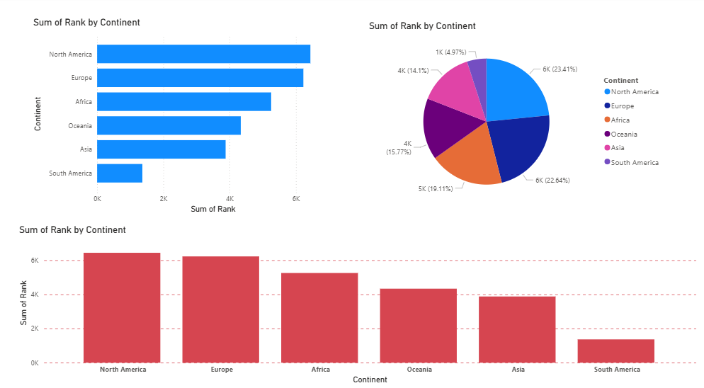

# 💊 Pharma Sales Analysis Dashboard (Power BI)

## 📌 Project Overview

This project presents an interactive **Pharmaceutical Sales Dashboard** built using **Microsoft Power BI**.  
The dashboard provides detailed insights into sales performance, product trends, regional distribution, and overall business growth within the pharmaceutical sector.

The objective of this project is to demonstrate data visualization, business intelligence, and analytical skills using Power BI.

---

## 📊 Dashboard Features

- 💰 Total Sales Overview  
- 📈 Sales Trends Over Time  
- 🌍 Region-wise Sales Performance  
- 🏥 Product Category Analysis  
- 👨‍⚕️ Sales Representative Performance  
- 📦 Top-Selling Products  
- 🎛️ Interactive filters and slicers  

---

## 🛠️ Tools & Technologies Used

- Power BI Desktop  
- Power Query (Data Cleaning & Transformation)  
- DAX (Data Analysis Expressions)  
- Data Modeling  
- Data Visualization Best Practices  

---

## 📷 Dashboard Screenshot



## 📂 Dataset Description

The dataset includes:

* Sales transaction data
* Product details
* Customer information
* Sales representatives
* Geographic data
* Time-based data (monthly & yearly sales)

---

## 📈 Key Insights

* Identified top-performing regions and products
* Analyzed seasonal sales patterns
* Evaluated sales representative performance
* Compared category-wise revenue contribution

---

## 🚀 How to Use

1. Download the `.pbix` file from this repository.
2. Open it using Power BI Desktop.
3. Use filters and slicers to interact with the dashboard.

---

## 🎯 Skills Demonstrated

* Data Cleaning
* Data Transformation
* Data Modeling
* DAX Calculations
* Dashboard Design
* Business Insight Generation

---

## 📌 Future Improvements

* Add sales forecasting (time-series analysis)
* Integrate real-time data source
* Enhance drill-through capabilities

---

## 👤 Author

**suman jana**

Aspiring Data Analyst | Power BI Developer

```
